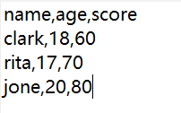
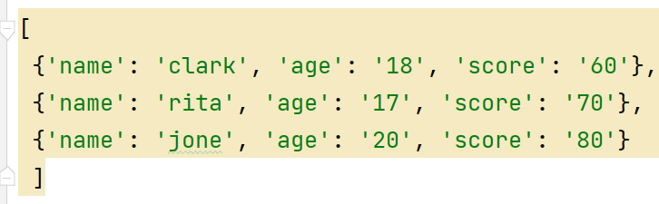

## Python文件读写操作

### 读取文件

1. 读取整个文件内容  f.read()、with语法

   问题：读取文件可能会出现问题，怎么处理？

2. 按行读取文件

   for line in fin  # 默认在每行的结尾有一个换行符

3. 把所有行读取出来，存入列表中

   fin.readlines() # 把所有行读取到列表中

   ```PYTHON
   dictword = {}
   with open('./英文词典.txt', encoding='utf-8') as f:
       for line in f:
           eng_name, chi_name = line.strip().split(',')
           dictword.setdefault(eng_name, chi_name)
   
   while True:
       print('#' * 30)
       engword = input("请输入英文：")
       if engword == 'quit':
           break
       res = dictword.get(engword)
       if res:
           print(f'该单词的中文意思是"{res}"')
       else:
           print('没找到该单词')
   ```

   

   **[练习：读取一个txt文件并对数据进行重构，原始TXT文件内容如下]()**                                                                                       

   对该数据结构进行重构，最后生成如下列表和字典变量组成的复合结构，如下：




results = []
with open('students.txt') as f:
    # print(f.readlines())
    listkeys = []
    listvals = []
    for ind,line in enumerate(f):
        if ind == 0:
            listkeys = line.strip().split(',')
        else:
            listvals = line.strip().split(',')
            tmpdict = dict(zip(listkeys, listvals))
            print(tmpdict)
            results.append(tmpdict)
print(results)
      ```


### 写入文件

- 怎么样把一个大字符串写入文件中  write()函数只能写入字符串，文件不存在会自动创建
- 怎么样按行写入文件  (用for循环来实现多行数据的写入，不过最后加入换行符)

练习：改进婚礼礼金程序

1. 写入功能：把每次输入的“姓名 礼金”信息，写入到txt文件中，一次输入一行数据，输入‘quit’退出

   ```python
   with open('./婚礼礼金.txt', 'w', encoding='utf8') as f:
       while True:
           cusinfo = input("请输入来宾和礼金中间用空格分割：")
           if cusinfo == 'quit':
               break
           print("#"*20)
           f.write(cusinfo + '\n')
   ```

2. 读取功能：按行读取上面生成的txt文件，把所有人的礼金依此读取出来形成一个列表，然后进行求总和，最高，最低，平均值。

   ```python
   moneys = []
   with open('./婚礼礼金.txt', encoding='utf8') as f:
       for line in f:
           name, money = line.strip().split()
           moneys.append(int(money))
   
   print("总计：", sum(moneys))
   print("最大金额：", max(moneys))
   ```

   

### 文件路径

- 读写文件时，如何指定文件路径？ 只写文件名程序会在当前路径下找文件

- 当读取的文件不在当前路径下是，可能用到下面两种访问方式

  - 绝对路径：从盘符开始直到文件所在文件夹的一个完整路径
  - 相对路径：默认从当前目录找文件显示的一种路径

  注意：文件路径的分割符，/ 与 \

- python中的os库包

  - 判断文件或者路径是否存在  （os.path.exists）


### 异常处理

- 目的：让程序不至于碰到错误就直接退出，可以更优雅的处理

- 定义：异常是一个事件，该事件会在程序执行过程中发生，影响程序的正常执行。Python如果无法正常处理程序就会发生一个异常。当程序发生异常时，我们需要捕获处理它，否则程序就会终止执行。常见异常如下：

  | 异常名            | 简要说明          |
  | ----------------- | ----------------- |
  | Exception         | 常规错误基类      |
  | ZeroDivisionError | 除（或取模）零    |
  | IOError           | 输入/输出操作失败 |
  | ImportError       | 导入模块对象失败  |
  | KeyError          | 映射中没有这个键  |
  | SyntaxError       | Python语法错误    |
  | ValueError        | 传入无效参数      |

- 语法：

  - try ... except  组合

  ```PYTHON
  lst1 = []
  while True:
      print('#'*20)
      grade = input("请输入成绩：")
      try:
          grade = int(grade)
      except ValueError as e:
          print("你输入的信息有误，请重新输入，错误信息为：", e)
          continue
      print(grade)
  ```

   	1. 捕获具体异常（如上所示）

  ​	 2. 捕获所有异常的父类（except Exception as e:）

  ​	 3. 不写异常对象，能捕获所有异常类型，但是没发打印错误日志（except:）

  - try ... except ... finally  组合

    finally：不管是否发生异常都会执行，一般用于关闭资源

  ```python
  f = open('写出文件', 'w')
  try:
      while True:
          data = input("输入信息：")
          data = int(data)
          f.write(str(data) + '\n')
  except Exception as e:
      print("错误信息为：", e)
  # 不管上面是否抛出异常都会执行
  finally:
      f.close()
  ```

