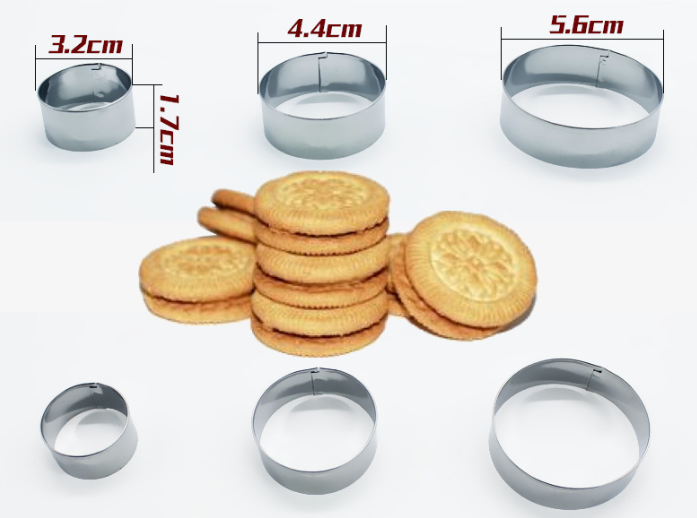
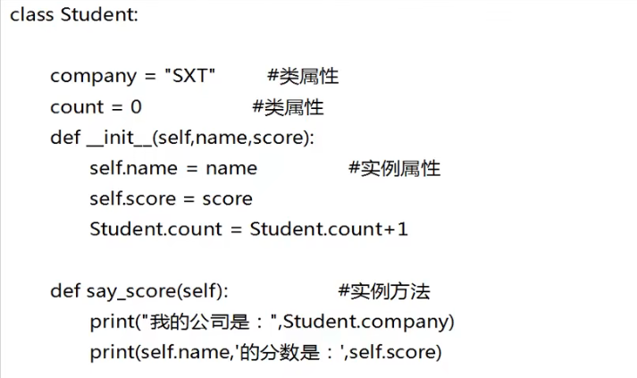
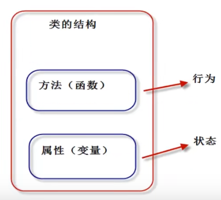
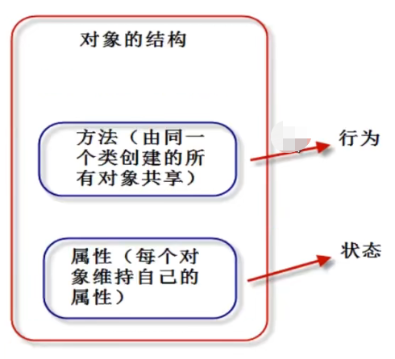

## Python面向对象

### 什么是面向对象

- 面向对象（Object Oriented Programming, OOP）编程思想主要针对的是大型软件项目，面向对象编程将数据本身和操作数据相关的方法都封装到对象中，面向对象思维是对现实的模拟，用代码模拟真实世界的场景和事物，让代码的编写、组织和理解都更加容易，大大提高编程的效率。

- Python面向对象完全支持面向对象的基本功能：继承，多态，封装
- 在Python中一切皆是对象，如前面学习的数据类型，函数等，都是对象。


### 面向过程和面向对象的区别

- 面向过程的特点：更加关注“程序的逻辑流程”，是一种“执行者”思维，适合小规模的程序

- 面向对象的特点：更加关注“软件中对象之间的关系”，是“设计者”思维，适合编写大规模的程序

  注意：


### 面向对象的思考方式

- 遇到复杂问题，先从问题中找名词（面向过程更多是去找动词），然后确定这些名词哪些可以确定为一个类，在根据问题的需求确定类的属性和方法，随之确定类之间的关系。 


### 面向对象编程的两大核心概念



- **类**：用来描述具有相同的属性和方法的对象的集合。它定义了该集合中每个对象所共有的属性和方法。对象是类的实例。

- **对象**：通过类定义的数据结构实例，它归属于某个类别的”个体”。它将不同类型的数据和方法放到一起，对象包括两个数据成员（类变量和实例变量）和方法

  一个简单的代码案例：




### 面向对象编程的语法

#### 定义类



- 类名：一般用驼峰表示发，大小写交错类似骆驼的脊背
- 构造方法：实例化对象的时候自动调用的方法 
- 特定参数self：代表对象本身，用它来方便使用该对象的属性和方法

```PYTHON
class Student:  # 类名一般首字母大写，遵守驼峰原则
    def __init__(self, name, score): # self 必须位于第一个参数位置
        self.name = name
        self.score = score
    def say_score(self):
        print("{}的分数是：{}".format(self.name, self.score))
```

#### 实例化对象



- 每个实例化的对象在内存中都是一块独立的区域
- 实例对象通过调用类对象来创建
- 实例对象继承类对象的所有属性，并获得自己的命名空间
- 实例对象可以拥有自己的私有属性

```PYTHON
s = Student('王钟',98)  #通过类名()来调用构造函数
s.say_score()
s.salary = 3000 # 定义该对象的私有属性
print(s.salary)
```

**[练习：建立一个Phone手机类]()**

1. 构造函数
   - 有两个形参model型号和price价格
   - 将model和price设置为self变量
2. 提供一个describe方法，用来描述手机信息
   - 返回“这是{model}手机，平均价格为{price}元”
3. 提供另一个方法call_friend(name)，表示打电话给朋友
   - 返回“我在用手机{model}，给朋友{name}打电话”
4. 定义两个实例对象，一个是IPhone/6000元，另一个是华为HuaWei/4000元， 然后调用各自的describe显示手机信息，并调用call_friend给你的朋友打电话。

```PYTHON
class Phone:
    def __init__(self, model, price):
        self.model = model
        self.price = price

    def describe(self):
        phoneinfo = f'这是{self.model}手机，价格为{self.price}元'
        return phoneinfo

    def call_friend(self, name):
        callinfo = f'我正在使用{self.model}手机，给朋友{name}打电话'
        return callinfo

# 在内存中开辟两个空间生成两个实例数据
phone1 = Phone('IPhone', 6000)
phone2 = Phone('HuaWei', 4000)
print(phone1.describe())
print(phone2.describe())
print(phone1.call_friend('李科'))
print(phone2.call_friend('李庆'))
```


#### 修改对象的属性

- 直接对属性进行赋值完成修改
- 用方法修改属性值（方法中可以写很多控制条件）

```PYTHON
class Student:  # 类名一般首字母大写，遵守驼峰原则
    def __init__(self, name, yuwen_score, shuxu_score): # self 必须位于第一个参数位置
        self.name = name
        self.yuwen_score = yuwen_score
        self.shuxu_score = shuxu_score

    def update_score(self, kemu, score):
        if kemu == '语文':
            self.yuwen_score = score
        elif kemu == '数学':
            self.shuxu_score = score

s1 = Student('王钟', 77, 88)
print(s1.yuwen_score)
print(s1.shuxu_score)
# 通过赋值修改属性
s1.yuwen_score = 92
print(s1.yuwen_score)
# 通过函数修改属性
s1.update_score('语文', 95)
print(s1.yuwen_score)
```


#### 类属性

- 定义：都是从属于“类”，它们是可以被所有实例对象共享的，通过类名去调用
- 课堂案例：基于上面的代码加入“学校名称”，加入一个函数来实现学生的自我介绍，并统计实例化的学生数量

```python
class Student:  # 类名一般首字母大写，遵守驼峰原则
    school_name = 'university01'  # 类属性
    count = 0  # 类属性

    def __init__(self, name, score): # self 必须位于第一个参数位置
        self.name = name
        self.score = score
        Student.count += 1

    def say_hello(self):
        print(f'我是{self.name},来自{Student.school_name}!')

    def say_score(self):
        print("{}的分数是：{}".format(self.name, self.score))

stu1 = Student('clark', 78)
stu2 = Student('rita', 68)
stu3 = Student('raye', 66)

stu2.say_hello()
Student.say_hello(stu3)
print(f'目前一共有{Student.count}名学生录入成绩！')
```


#### 类方法

- 定义：从属于类对象的方法（操作类属性的方法），类方法需要用装饰器@classmethod来定义

- 语法：

  ```python
  @classmethod
  def 类方法名(cls [, 形参列表]):
  	函数体
  ```

- 要点：

  - @classmethod必须位于方法上面一行
  - 第一个cls必须有：cls指“类对象”本身，调用格式“类名.类方法名(参数列表)”，参数列表中不需要给cls传值
  - **类方法中访问实例属性和实例方法会出错** 
  - 子类继承父类方法时，传入cls是子类对象。

  ```PYTHON
  class Student:
      school_name = 'university01'
  
      @classmethod
      def printschool(cls):
          print(f'My school is {Student.school_name}')
  
  Student.printschool()
  ```

  **[同步练习]()**

  任务一：基于上面的Phone手机类，加入两个类属性如下：

  - 地区为重庆
  - 在售手机类型的数量

  任务二：加入一个类方法countcnts，来展示重庆地区在售手机类型的总数

  *[思考：如何计算以实例化手机的平均价格？]()*

  ```PYTHON
  class Phone:
      area_name = 'CQ'
      type_cnt = 0
      prices = []
  
      def __init__(self, model, price):
          self.model = model
          self.price = price
          Phone.type_cnt += 1
          Phone.prices.append(price)
  
      def describe(self):
          phoneinfo = f'这是{self.model}手机，价格为{self.price}元'
          return phoneinfo
  
      def call_friend(self, name):
          callinfo = f'我正在使用{self.model}手机，给朋友{name}打电话'
          return callinfo
  
      @classmethod
      def countcnts(cls):
          print(f"当前{Phone.area_name}地区在售手机类型总数为{Phone.type_cnt}种！, "
                f"平均价格为{sum(Phone.prices)/len(Phone.prices)}")
  ```

  

  

#### 静态方法

- 定义：跟类对象完全无关的方法，称为“静态方法”，跟定义模块函数差不多，只是调用的时候需要用类名

- 语法：

  ```python
  @staticmethod
  def 静态方法名([形参列表]):
  	函数体
  ```

- 要点：

  - 通过类名来调用
  - **不能访问实例对象和实例方法**

  ```PYTHON
  class Student:
      school_name = 'university01'
  
      # def __init__(self, name):
      #     self.name = name
  
      @staticmethod
      def addnum(a, b):
          print(f'a + b = {a+b}')
          print(f'My school is {Student.school_name}')
  
  Student.addnum(22,11)
  ```


#### 其他方法

- \_\_del\_\_()析构方法内存回收机制

- \_\_call\_\_()方法是定义可调用对象，该对象可以像函数一样调用

  ```PYTHON
  class accoutsalary:
  
      def __call__(self, salary):
          print("计算工资了")
          daysalary = salary//30
          hoursalary = daysalary/8
          return daysalary, hoursalary
  
  s1 = accoutsalary()
  print(s1(30000))
  ```


### 面向对象的三大特性：

- **封装（隐藏）**：隐藏对象的属性和实现细节，只对外提供必要的方法。相当于将“细节封装起来”，只对外暴露相关调用的方法。通过对象的“私有属性”和"私有方法"可以实现封装
- **继承**：继承可以让子类具有父类的特性，提高代码的重用性。从设计上来说，是一种增量进化，原有父类设计不变的情况下，可以增加新功能，或者改进已有的算法。
- **多态**：多态是同一个方法调用由于对象不同产生不同的行为。生活中有非常多的例子，比如休息，比如幸福的定义等等。。


#### 继承

- 概述：面向对象程序的重要特征，也是实现“代码复用”的重要手段。如果一个新类继承自一个已经设计好的类，就直接具备了已有类的特征，这样可以大大降低工作难度。已有的类，我们称为“父类或者基类”，新的类，我们称为“子类或者派生类”

- 语法结构（Python支持多重继承，一个子类继承多个父类）

  ```
  class 子类类名(父类1[, 父类2....]):
  	类体
  ```

- 要点：

  - object类：这是所有类的基类，如果没有指定父类，默认该类的父类都是object类
  - 成员继承：子类继承了除构造方法以外的所有成员
  - 方法重写：子类可以重新定义父类的方法，这样机会覆盖父类的方法，也称为“重写”

  ```PYTHON
  class Person:
      def __init__(self, name, age):
          self.name = name
          self.age = age
      def say_hello(self):
          print(f'我的名字是{self.name}，年龄为{self.age}岁！')
  
  class Student(Person):
      def __init__(self, name, age, score):
          Person.__init__(self, name, age)
          #super().__init__(name, age)
          self.score = score
      # 重写父类的方法
      def say_hello(self):
          print(f"你好！，我是学生{self.name},今年{self.age}岁，我考了{self.score}分")
  
  stu1 = Student('clark', 18, 60)
  print(stu1.name)
  print(stu1.score)
  stu1.say_hello()
  ```

  **[练习：建立子类IPhone，继承自父类Phone（前面练习已建立），设定功能如下：]()**

  - 构造函数除父类的model和price属性，在额外加入手机版本version
  - 重写父类的call_friend方法，体现version版本号，如“我正在使用苹果13给xxx打电话！”
  - 建立多个不同版本苹果时候的实例对象，基于之前父类Phone定义的类方法countcnts，统计子类IPhone实例对象的总个数，并计算它们的平均价格。

  ```PYTHON
  class Phone:
      area_name = 'CQ'
      type_cnt = 0
      prices = []
  
      def __init__(self, model, price):
          self.model = model
          self.price = price
          Phone.type_cnt += 1
          Phone.prices.append(price)
  
      def describe(self):
          phoneinfo = f'这是{self.model}手机，价格为{self.price}元'
          return phoneinfo
  
      def call_friend(self, name):
          callinfo = f'我正在使用{self.model}手机，给朋友{name}打电话'
          return callinfo
  
      @classmethod
      def countcnts(cls):
          print(f"当前{Phone.area_name}地区在售手机类型总数为{Phone.type_cnt}种！, "
                f"平均价格为{sum(Phone.prices)/len(Phone.prices)}")
  
  
  class IPhone(Phone):
  
      def __init__(self, model, price, version):
          Phone.__init__(self, model, price)
          self.version = version
  
      def call_friend(self, name):
          print(f"我在用{self.model}{self.version}给朋友{name}打电话！")
  
      # @classmethod
      # def countcnts(cls):
      #     print(f"当前{Phone.area_name}地区在售苹果手机类型总数为{Phone.type_cnt}种！, "
      #           f"平均价格为{sum(Phone.prices) / len(Phone.prices)}")
  
  
  p1 = IPhone('苹果',8000,13)
  p2 = IPhone('苹果',6000,11)
  IPhone.countcnts() # 子类可以继承父类的类方法
  ```

  